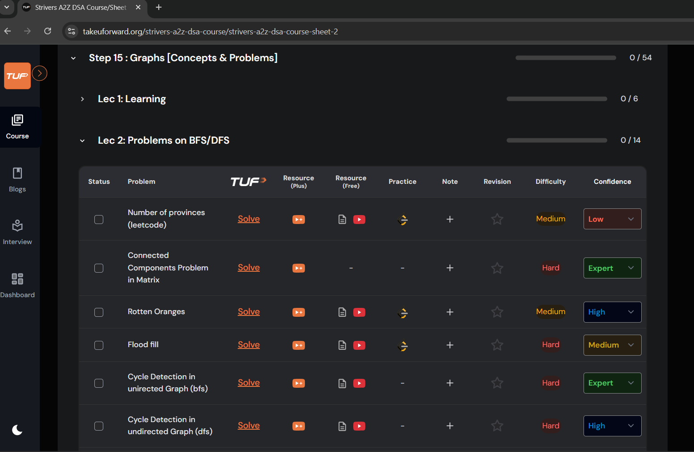

# 🧠 TakeYouForward DSA Confidence Tracker

A Chrome browser extension that enhances the TakeYouForward DSA (Data Structures and Algorithms) learning platform by allowing users to track their confidence levels for different problems directly on the website. 🚀

<div align="center">
  



[](https://github.com/your-username/tuf-dsa-tracker)
[](LICENSE)
[](https://github.com/your-username/tuf-dsa-tracker/stargazers)

</div>

## ✨ Features

- 📊 **Confidence Tracking**: Rate your confidence on a 5-level scale (Not Set, Low, Medium, High, Expert)
- 🎨 **Visual Progress**: Color-coded confidence levels for quick visual assessment
- ☁️ **Cloud Sync**: Sync your confidence data across multiple devices
- 🔐 **User Authentication**: Secure user accounts with username/password
- 📈 **Statistics**: View your overall progress through the popup interface
- ⚡ **Real-time Updates**: Changes sync automatically across all your devices

## 📦 Installation

### 🛠️ Option 1: Manual Installation (Free)

1. Download or clone this repository
2. Open Chrome and go to `chrome://extensions/`
3. Enable "Developer mode" in the top right corner
4. Click "Load unpacked" and select the project folder
5. The extension will appear in your browser toolbar

### 🏪 Option 2: Chrome Web Store (Coming Soon)

The extension will be available on the Chrome Web Store for easy installation.

## 🎯 Usage

1. 🌐 **Visit TakeYouForward**: Go to any DSA course page on takeuforward.org
2. 👀 **See the Confidence Column**: A new "Confidence" column will automatically appear in problem tables
3. 📝 **Set Your Confidence**: Use the dropdown in each row to select your confidence level
4. 👤 **Create Account**: Click the extension icon and sign up for cloud sync
5. 🔄 **Sync Across Devices**: Your confidence data will automatically sync across all your devices

## 🎨 Confidence Levels

- 🔘 **Not Set** (Gray): Haven't attempted or reviewed this problem
- 🔴 **Low** (Red): Struggled with the problem, need more practice
- 🟡 **Medium** (Yellow): Solved but with some difficulty
- 🔵 **High** (Blue): Solved confidently with minor help
- 🟢 **Expert** (Green): Can solve independently and explain to others

## ☁️ Cloud Sync Setup

1. Click the extension icon in your toolbar
2. Click "Sign Up" to create a new account
3. Enter a username and password
4. Your confidence data will automatically sync across all devices where you're logged in

## 🏗️ Technical Architecture

### 🎨 Frontend (Chrome Extension)
- **Content Script**: Injects confidence tracking into TakeYouForward pages
- **Popup Interface**: Shows statistics and authentication controls
- **Background Service**: Manages extension lifecycle and updates
- **Sync Manager**: Handles cloud synchronization

### ⚙️ Backend (API Server)
- **Node.js Express Server**: RESTful API for user management and data storage
- **PostgreSQL Database**: Secure storage for user accounts and confidence data
- **Session-based Authentication**: Secure user session management

## 👨‍💻 Development

### 🛠️ Local Development

```bash
# Clone the repository
git clone https://github.com/your-username/tuf-dsa-tracker.git
cd tuf-dsa-tracker

# Install dependencies
npm install

# Create environment file
cp .env.example .env
# Edit .env with your database credentials

# Start the API server
node api-server.js

# Load extension in Chrome for testing
# Go to chrome://extensions/ → Enable Developer Mode → Load Unpacked
```

### 🔌 API Endpoints

- `POST /api/auth/signup` - Create new user account
- `POST /api/auth/login` - User login
- `GET /api/confidence` - Get user's confidence data
- `POST /api/confidence/sync` - Sync confidence data
- `GET /api/stats` - Get user statistics

## 🔒 Privacy & Security

- All data is encrypted in transit using HTTPS
- Passwords are securely managed (hash in production)
- No personal data is collected beyond username and confidence levels
- Data is stored securely in PostgreSQL database
- Users can delete their accounts and data at any time

## 🌐 Browser Compatibility

- Chrome (Manifest V3)
- Microsoft Edge (Chromium-based)
- Other Chromium-based browsers

## 🤝 Contributing

We love your input! We want to make contributing as easy and transparent as possible:

1. 🍴 Fork the repository
2. 🌿 Create a feature branch (`git checkout -b feature/AmazingFeature`)
3. ✨ Make your changes
4. ✅ Test thoroughly
5. 📝 Commit your changes (`git commit -m 'Add some AmazingFeature'`)
6. 🚀 Push to the branch (`git push origin feature/AmazingFeature`)
7. 🔄 Submit a pull request


## 📄 License

This project is open source. Feel free to use, modify, and distribute according to your needs.

## 💬 Support

Need help? We've got you covered! 

- 🐛 **Found a bug?** [Create an issue](https://github.com/aryanx16/TUF_x1/issues)
- 💡 **Have an idea?** [Request a feature](https://github.com/aryanx16/TUF_x1/issues)

- 📧 **Contact us**: [aryanbabare1@gmail.com](mailto:aryanbabare1@gmail.com)

<div align="center">
  
**Made with ❤️ for DSA learners worldwide**


</div>

## 📋 Changelog

### v1.0.0
- Initial release
- Basic confidence tracking
- Cloud synchronization
- User authentication
- Cross-device sync
- Statistics tracking